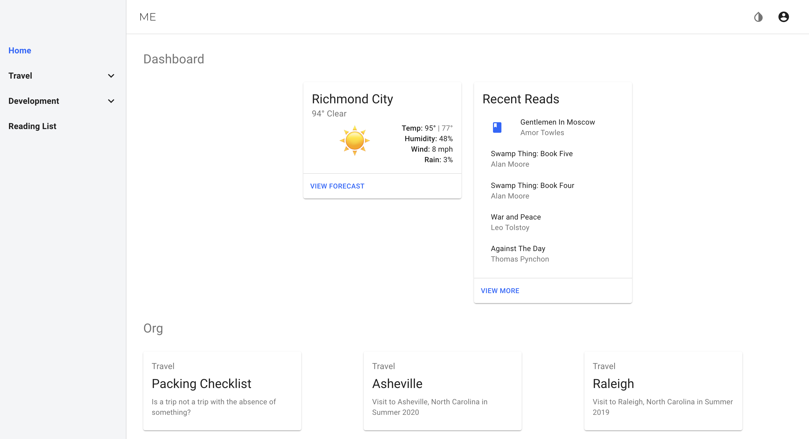

# Me

A personal portal for me. Designed to be response and mobile first, Me is a mix of static content (published with org-mode), trips, notes, TODO, etc., and dynamic content. The motivation being the need to organize the content around my life into an application that I can access anywhere, and interact with, if needed.

Check it [out over here](https://me.brianbrown.dev).

# Features

* Progressive Web App
* Reading List
* Load static posts (published with org-mode)
* Light/Dark Theme
* Login/Authentication with Auth0
* Weather from DarkSky
* Finances 

# Stack

* React 16
* React Material UI
* OrgMode

